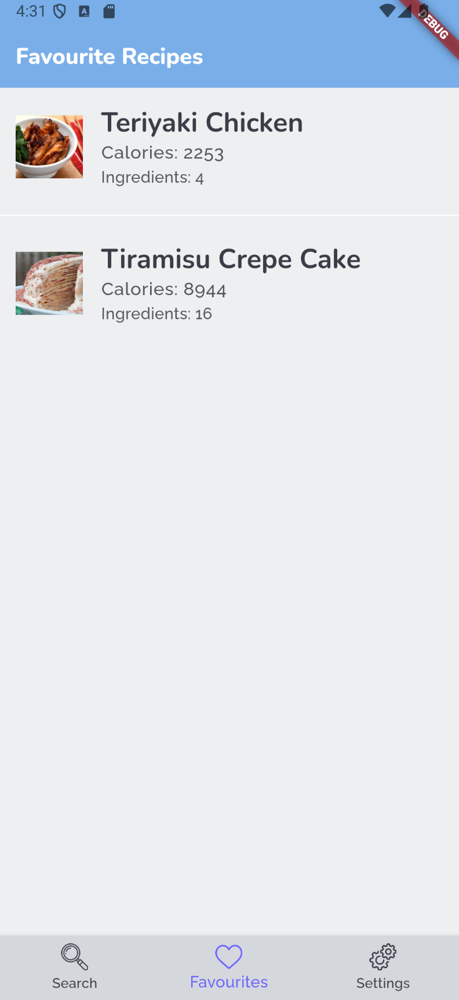

# WhatEat! 🍽️

WhatEat! is a Flutter application designed to help users explore recipes and save favorites. The app integrates with the Edamam API.

## Screenshots

### Search Screen

### Search Results

### Recipe Detail

### Favorites

### Settings 
